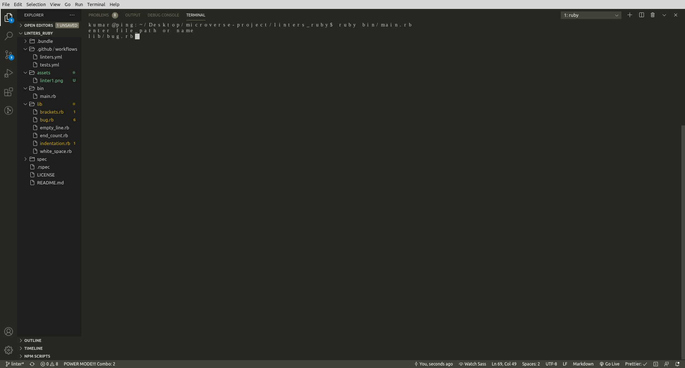
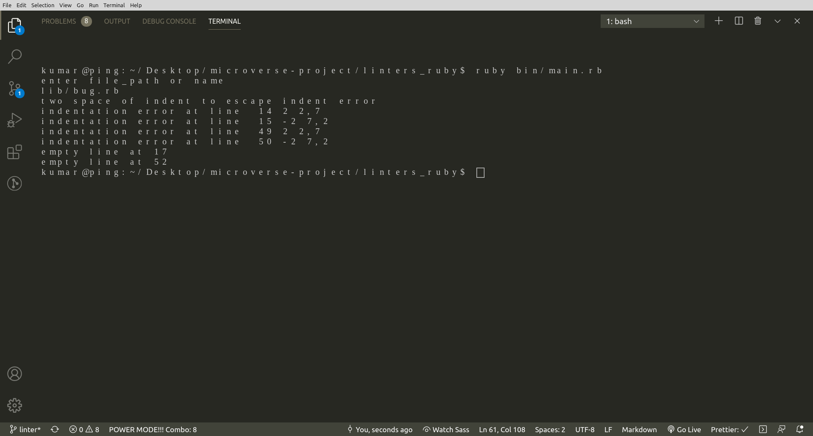

<h3 align="center">Lintit - A Custom Linter developed in Ruby to check Ruby files</h3>

## About <a name = "about"></a>

<h3 align="center"> This custom code linter is the Capstone Project for the Ruby Course. The main goal is to put into practice the main concepts of Object Oriented Programming. Particularly, classes and access to their attributes.</h3>

<p align="center">

</p>

<h2 align="center">How to Install</h2>

<h3>Downloading</h3>

1- Download this repository,

2- Unpack it,

3- Copy its address,

4- Open your terminal commandline,

5- Write "cd" and paste the address of the folder that you unpacked the repo

<h3>Cloning</h3>

1- Copy repo address,

```

  https://github.com/jamestucker1988/linters_ruby.git

```

2- Open your terminal commandline,

3- Run git clone,

```

  git clone https://github.com/jamestucker1988/linters_ruby.git

```

<h2>How to Use</h2>

After setting up the repo and installing the colorize gem, run the following command to execute the linter in the repo directory on your commanline,

```

step1 ruby  bin/main.rb
step2 Enter the name of path or file_name
```

In this case a bug file resides in "lib/bug.rb" created for the reviewers to check the code,
hence Enter lib/bug.rb at step 2.

Running the desired file without any additional argument will ask for
filepath or name of file.



At the end of each return, the user will be informed about the number of detected cases with line number and error type,



<h2>Abilities</h2>

1. Check the indentation misusage : Use two spaces per indentation level .

```

 # bad - four spaces
def some_method
    do_something
end

# good
def some_method
  do_something
end

```

2. Check the line between methods : Use empty lines between two lines is forbidden.

3. Check for missing brackets.

4. Check for end of statement and inform.

5. Chceck and fix the white spaces : Avoid trailing whitespace.

---

## 🔧 Built with<a name = "built_using"></a>

- [Ruby](https://www.ruby-lang.org/) - Ruby
- [Rspec](https://www.rspec.com) - A test driven framework

## ✒️ Autor <a name = "author"></a>

👤 **Anand Kumar**

[<code></code>](https://github.com/jamestucker1988)
[<code></code>](https://twitter.com/anandku74070598)
[<code></code>](https://www.linkedin.com/in/anand-kumar-912878189/)

## 🤝 Contributing

Contributions, issues and feature requests are welcome!

Feel free to check the [issues page](https://github.com/jamestucker1988/linters_ruby/issues).

## 👍 Show your support

Give a ⭐️ if you like this project!

## 📝 License

This project is free to use as learning purposes. For any external content (e.g. logo, images, ...), please contact.
